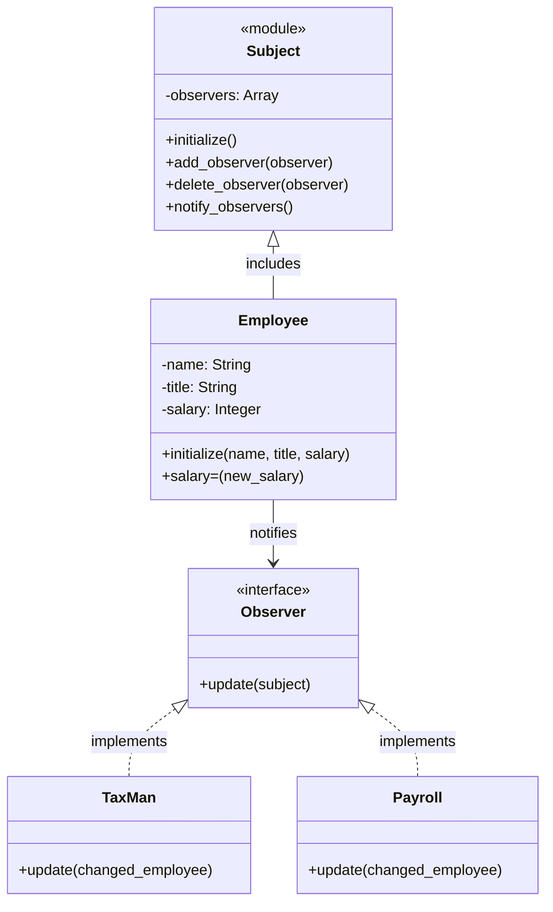

# Observerパターン

## クラス図



## IRBでの実行方法

1. プロジェクトのルートディレクトリに移動します：
```bash
cd ruby-design-pattern
```

2. IRBを起動します：
```bash
irb -r ./observer/init
```

3. 動作確認：

### 入力例
```ruby
fred = Employee.new('Fred', 'Crane Operator', 300000)
payroll = Payroll.new
tax_man = TaxMan.new
fred.add_observer(payroll)
fred.add_observer(tax_man)
fred.salary = 40000000
```

## 出力例
```
Fredのために小切手を切ります。
彼の給料は40000000になりました。
Fredのために新しい税金の請求書を送ります。
```
