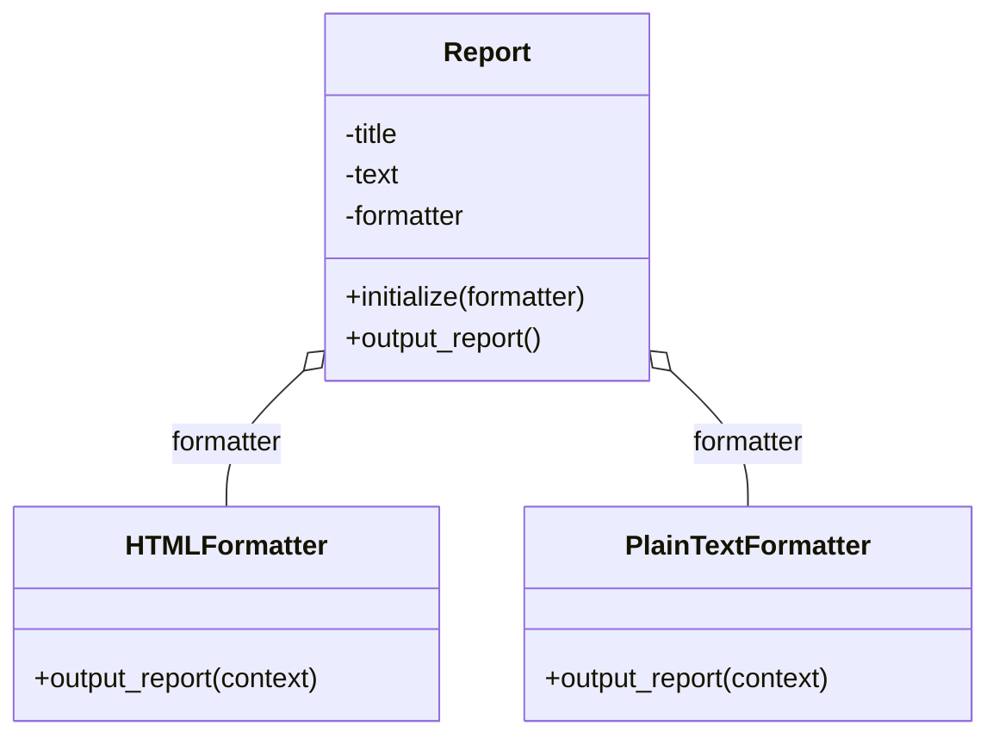

# Strategyパターン

## クラス図



## IRBでの実行方法

1. プロジェクトのルートディレクトリに移動します：
```bash
cd ruby-design-pattern
```

2. IRBを起動します：
```bash
irb -r ./strategy/init
```

3. レポートを生成して出力します：

### HTMLフォーマッターを使用する例
```ruby
html_report = Strategy::Report.new(Strategy::HTMLFormatter.new)
html_report.output_report
```

### プレーンテキストフォーマッターを使用する例
```ruby
plain_text_report = Strategy::Report.new(Strategy::PlainTextFormatter.new)
plain_text_report.output_report
```

## 出力例

### HTMLフォーマッターの出力
```html
<html>
  <head>
    <title>Monthly Report</title>
  </head>
  <body>
    <p>Things are going</p>
    <p>really, really well.</p>
  </body>
</html>
```

### プレーンテキストフォーマッターの出力
```
***** Monthly Report *****
Things are going
really, really well.
```
