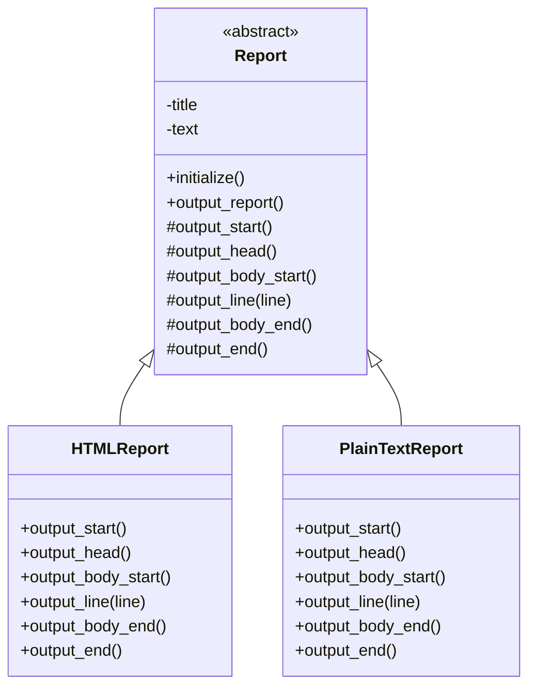

# Template Method パターン

## クラス図



## IRBでの実行方法

1. プロジェクトのルートディレクトリに移動します：
```bash
cd ruby-design-pattern
```

2. IRBを起動します：
```bash
irb -r ./template_method/init
```

3. レポートを生成して出力します：

##### HTMLレポートを使用する例
```ruby
html_report = TemplateMethod::HTMLReport.new
html_report.output_report
```

##### プレーンテキストレポートを使用する例
```ruby
plain_text_report = TemplateMethod::PlainTextReport.new
plain_text_report.output_report
```

#### beforeコード
```ruby
class Report
  def initialize
    @title = 'Monthly Report'
    @text = ['Things are going', 'really, really well.']
  end

  def output_report
    if format == :plain
      puts "***** #{@title} *****"
    elsif format == :html
      puts '<html>'
      puts '<head>'
      puts "<title>#{@title}</title>"
      puts '</head>'
      puts '<body>'
    else
      raise "Unknown format: #{format}"
    end

    @text.each do |line|
      if format == :plain
        puts line
      else
        puts "<p>#{line}</p>"
      end
    end

    return unless format == :html

    puts '</body>'
    puts '</html>'
  end
end
```
